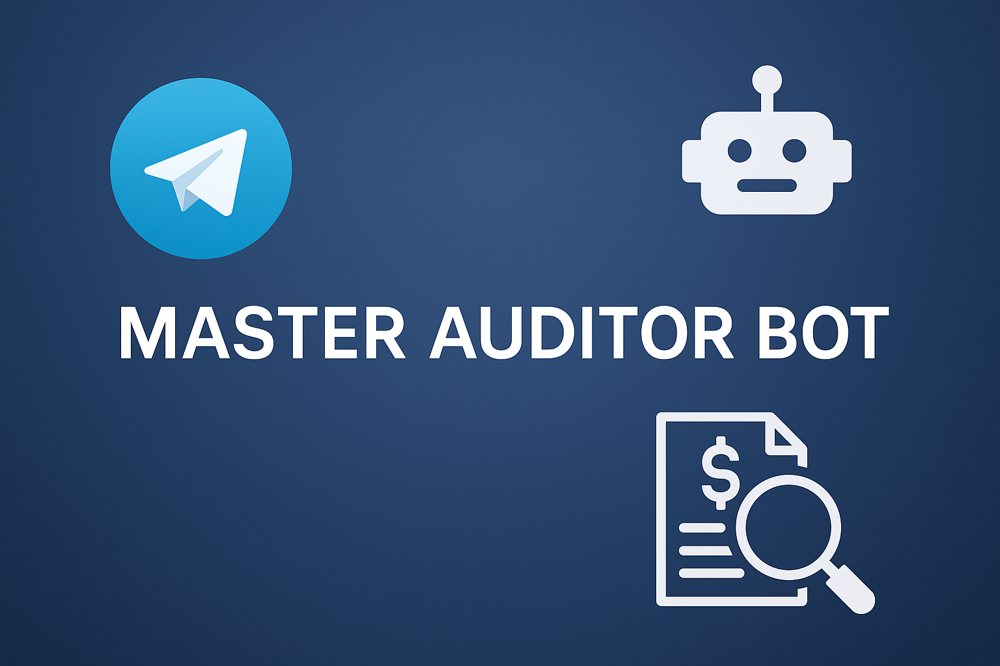

# Auditor Master Bot

<a href="https://github.com/jaterub/my_telegram_bot/releases/download/Demo/bot_demo.mp4" target="_blank" rel="noopener noreferrer">
  
</a>

> Consejo: publica el vídeo en una plataforma de streaming (Drive, YouTube, GitHub Releases) y enlázalo para evitar inflar el repositorio con binarios.

## Contenido

- [Descripción general](#descripción-general)
- [Flujo de trabajo](#flujo-de-trabajo)
- [Comandos disponibles](#comandos-disponibles)
- [Arquitectura técnica](#arquitectura-técnica)
- [Configuración y despliegue](#configuración-y-despliegue)
- [Guía rápida de contribución](#guía-rápida-de-contribución)

## Descripción general

Auditor Master Bot es un asistente de Telegram orientado a auditorías contables. Permite subir archivos Excel, procesarlos en Databricks y devolver hallazgos relevantes, incluyendo un resumen generado con LLM. Los resultados se almacenan en SQLite para consultas posteriores.

## Flujo de trabajo

1. **Subida de Excel**: el usuario envía un `.xlsx` al bot.
2. **Workspace Databricks**: el archivo se publica en Workspace Files y se lanza el job `audit_xlsx_workspace_summary`.
3. **Procesamiento**: el notebook calcula duplicados, desbalances, monedas inválidas y otras métricas.
4. **Persistencia**: `utils/db.py` guarda (o actualiza) el resultado en `audits.db`.
5. **Resumen LLM**: `utils/llm.summarize_audit_spanish` genera un informe legible.
6. **Respuesta**: el bot devuelve el resumen y deja la auditoría disponible para consultas futuras.

## Comandos disponibles

- `/audit`: sube un Excel y lanza la auditoría completa.
- `/audits`: muestra las últimas auditorías con métricas clave.
- `/history`: historial compacto con `llm_summary` cuando existe.
- `/session`: lista los archivos procesados en la sesión actual.
- `/chat`: activa el modo conversación con el LLM (texto y voz).
- `/reset`: limpia el historial de conversación del LLM.

Mensajes sin comando también se envían al LLM siempre que el modo chat esté activo.

## Arquitectura técnica

- **Handlers de Telegram** (`handlers/`):
  - `audit_xlsx.py`: flujo principal de auditoría y registro en SQLite.
  - `audits_list.py`, `history.py`: comandos de consulta.
  - `llm_chat.py`: conversación contextual basada en los resultados recientes.
- **Integraciones**:
  - `utils/databricks_upload.py`, `wsfiles_check.py`: interacción con Workspace Files.
  - `utils/llm.py`: acceso a OpenAI (chat y Whisper).
- **Persistencia**:
  - `utils/db.py`: esquema único (`audits`) con upsert por `run_url`.
  - `audits.db`: base SQLite local (ruta configurable vía `SQLITE_PATH`).

## Configuración y despliegue

1. Crea y rellena `.env` (Telegram token, host/token de Databricks, API key de OpenAI).
2. Instala dependencias: `pip install -r requirements.txt`.
3. Inicializa la base local: `python -c "from utils.db import init_db; init_db()"`.
4. Ejecuta el bot: `python app.py`.

### Variables principales en `.env`

```
TELEGRAM_BOT_TOKEN=...
DATABRICKS_HOST=...
DATABRICKS_TOKEN=...
OPENAI_API_KEY=...
SQLITE_PATH=audits.db
```

## Guía rápida de contribución

1. Crea una rama: `git checkout -b feature/nueva-funcionalidad`.
2. Añade pruebas o scripts si corresponde.
3. Ejecuta linters/formatters (consulta `formatters/`).
4. Abre un PR describiendo los cambios y requisitos adicionales.

¡Listo! Revisa la demo para ver el bot en acción antes de proponer mejoras.
